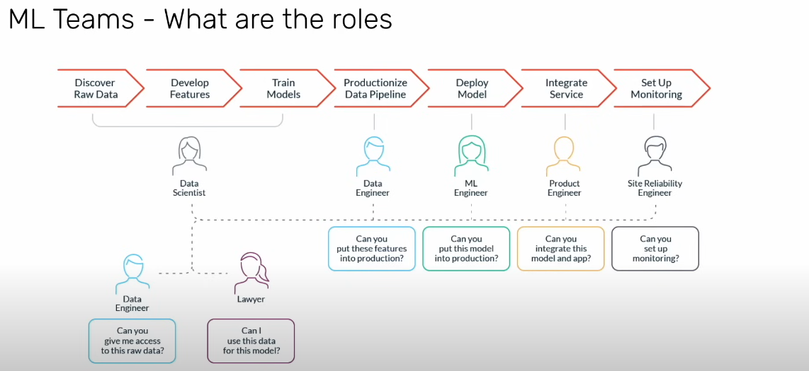

# Overview
ML code is 0nly 20% of Machine Learning. 80% is engineering.
MLOps is defined as "the extension of DevOps methodology to inlcude machine learning and data science assets as first-class citizens within the Devops ecology".

## ML Teams

## Data Science
